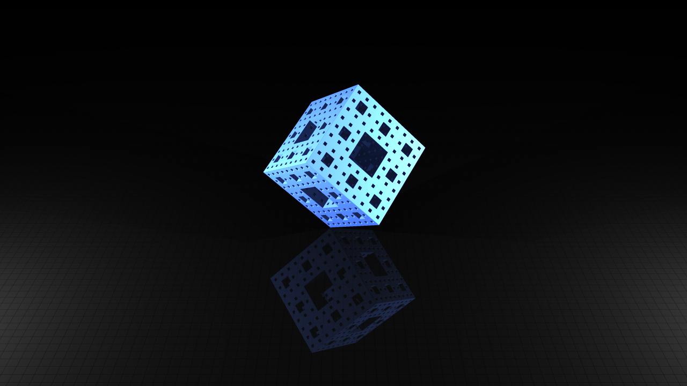

# Signed Distance Field

SDF project based on Yocto/GL Library.

In SDF each shape is rapresented by an implicit function. union int ecc

- raymarcher.cpp
It contains the application code through which it is possible to render the image defined in scene_sdf.cpp.
- scene_sdf.cpp
It contains the standard functions that must be completed to define a scene.
-- load_texture
this function must be implemented to load textures.
-- make_camera# Signed distance field
this function defines camera position and its features.
-- make_lights
this function defines lights position and intesity.
-- materials
this function defines material features for each shape in the scene.
-- fScene
this function defines the scene.
Given the coordinates of a point, it returns the shortest distance between that point and some surface.
- math_sdf.cpp
It contains some basic fuction to manipulate vectors, matrices and other simple math operations.
- func_sdf.cpp
In this file there are some basic distance functions.


## Images



## Getting Started

### Build
How to build:
``` shell
mkdir build; cd build; cmake ..; cmake --build .
```

### Run
To run application:
``` shell
./yraymarcher
```

### Parameters
- **-r** or **--resolution**: to specify vertical resolution, default 720
- **-s** or **--sample**: to specify per-pixel samples, default 1
- **-a** or **--ambient**: to specify ambient color, default 0.1f
- **-o** or **--output**: to specify output image, default "../images/out.hdr"

For example:
``` shell
./yraymarcher -r 1024 -s 3 -a 0.2f -o "../images/yourout.hdr"
```

## Authors
* **Mattei Francesca Romana** - ...
* **Montagnini Dario** - ...
* **Riso Marzia** - ..
